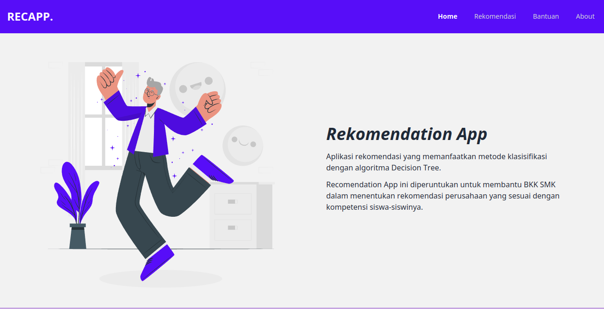
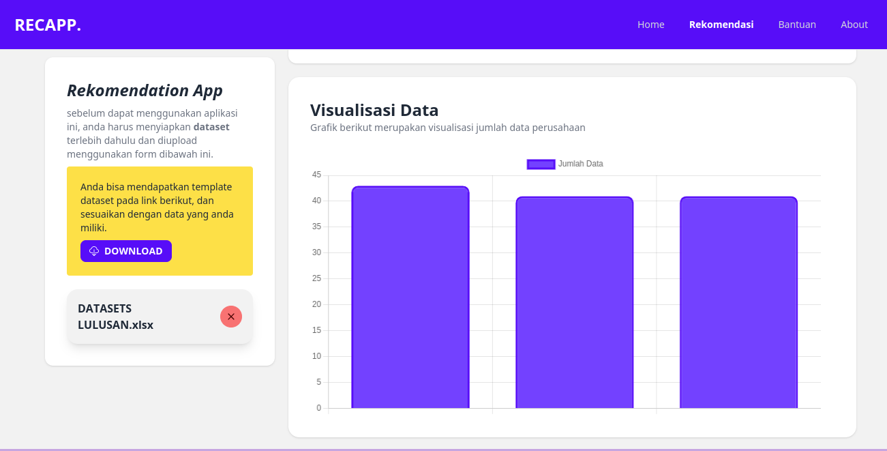
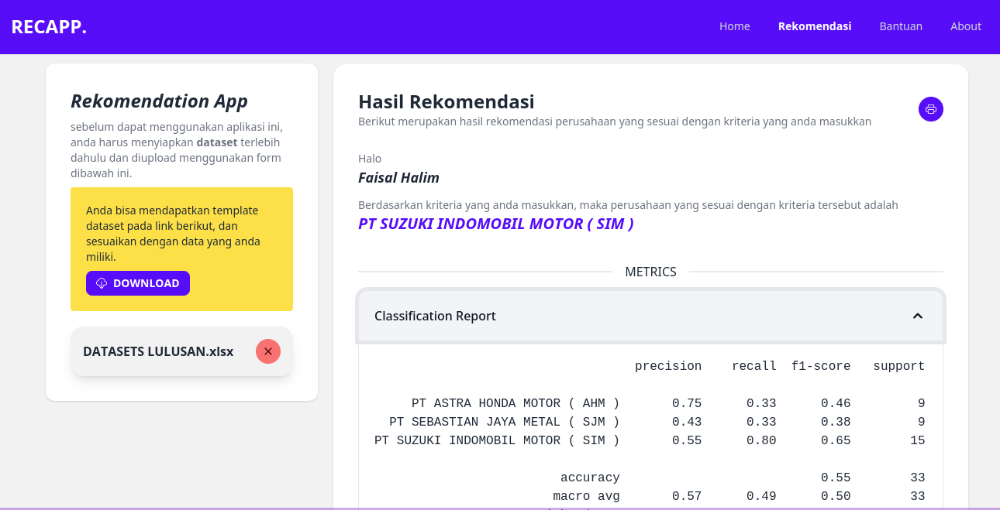

# Django Recomendation App
Sisrem rekomendasi perusahaan menggunakan django, aplikasi ini dibuat sebagai project akhir dan penelitian skripsi. pembuatan aplikasi ini menggunakan bahasa pemrograman python dan framework django. aplikasi ini menggunakan algoritma decision tree untuk merekomendasikan perusahaan yang sesuai dengan kriteria yang diinginkan oleh pengguna. 

data yang digunakan merupakan data siswa yang telah lulus dan sudah bekerja, data yang dipakai diambil dari data alumni **SMK Gondang**.

## Demo
|||
|:---:|:---:|
|  |  |
|  |  |

### Penggunaan
- download project 
- install requirement `pip install -r requirements.txt`
- jalankan program `python manage.py runserver`
